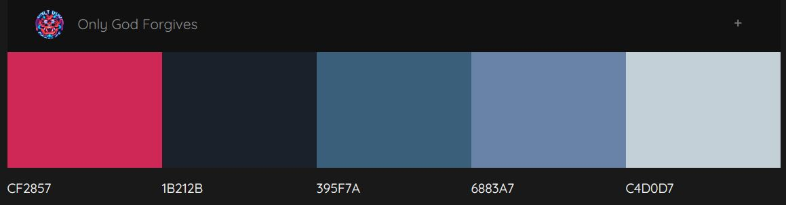
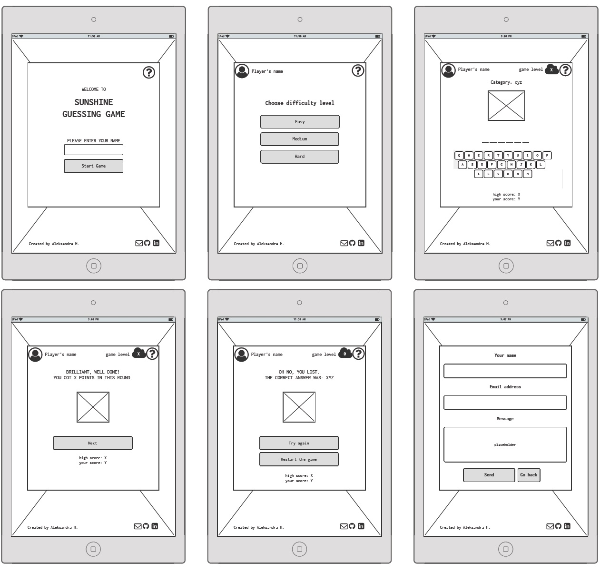
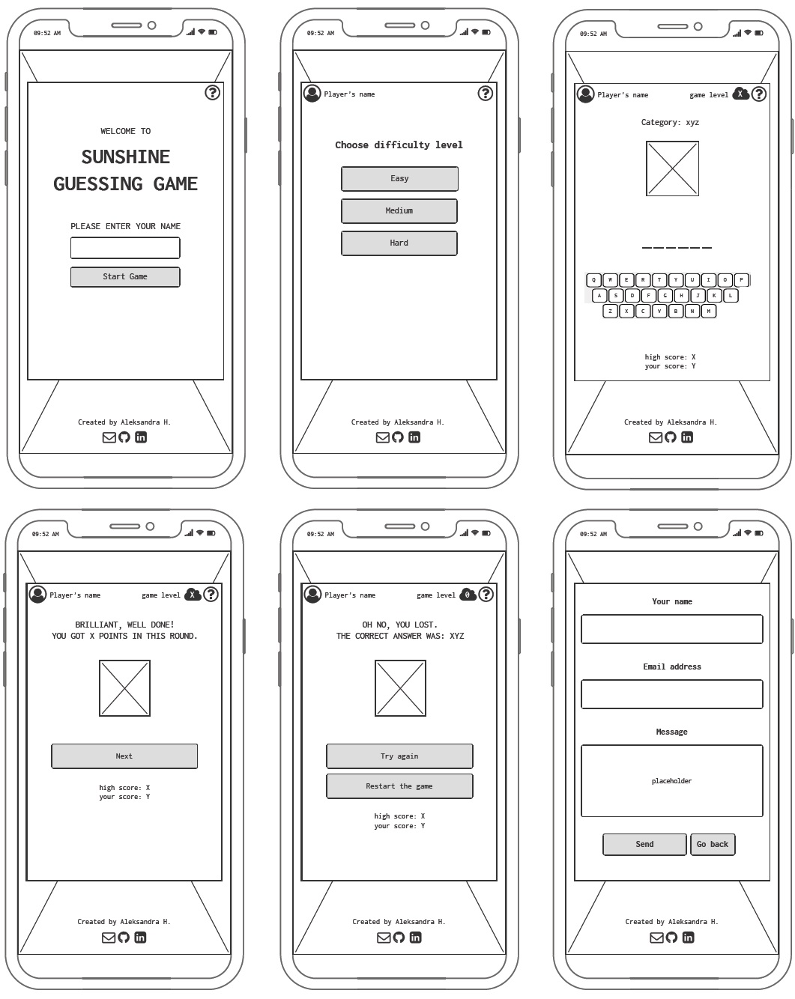
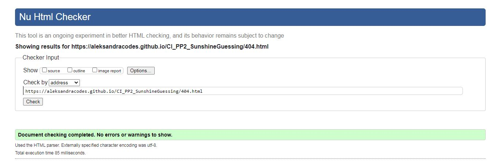
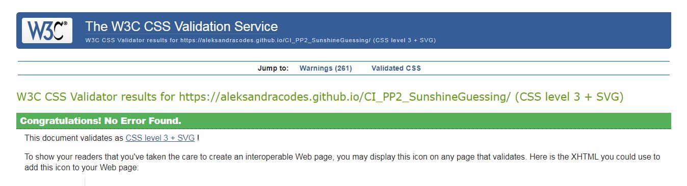

# Sunshine Guessing Game 

**Developer: Aleksandra Haniok**

[Visit live website](https://aleksandracodes.github.io/CI_PP2_SunshineGuessing/)

## Project Goals

The goal of this project was to create an interactive and user-friendly version of the well-known Hangman game.

### User Goals

- Play a game with simple rules that is fun and engaging
- Challenge themselves on different words and phrases

### Site Owner Goals

- Create a game which is entertaining and engaging
- Create visually appealing design
- Create a simple navigation around website
- Provide fully responsive and accessible website

## User Experience

### Target Audience

- The game can be played by anyone who likes word guessing games
- Anyone who wants to have fun playing a game with simple and clear rules

### User Requirements and Expectations

- Easy to understand game rules
- Simple navigation
- Simple presentation of content on the page that makes logical sense
- A responsive wesite that allows the user to play the game on any devise
- Links and functions that work as expected
- An easy way to contact the developer and leave feedback
- Accessibility

## User Stories

### Site User

1. I want to easily understand the rules of the game
2. I want to enter my name and have it visible on screen while the game is played
3. I want to be able to choose a difficulty level for the game
4. I want to have different categories of phrases to guess from
5. I want to be able to play the game both by clicking the mouse and by using the keyboard
6. I want to be able to see which letters I have already guessed and the number of guesses I have left in the round
7. I want to see my result after I guessed the phrase
8. I want to see the phrase I didn’t manage to guess
9. I want to be able to play the game on desktop, tablet and mobile devices
10. I want to be able to get in touch with the developer
11. I want to be sure that my message has been sent

### Site Owner

12. I want user to easily understand the game
13. I want the user to be able to challenge themselves
14. I want my game to be fully responsive
15. I want the user to come to a 404 page instead of having to use the browser back button if they're searching for a page which does not exist

## Design

### Colour Scheme

The colour scheme across the screens was kept simple and consistent and was inspired by the colours of the sky and sun.
- For the contrast, the shade of the pink was used for error message and unguessed phrase
- Game title and game navigation buttons are orange

The pallet used was found on [Colormind.io](http://colormind.io/)

### Fonts

Google Fonts were implemented on the website. Nunito with sans-serif fallback was used across all screens as I found it highly readable and clear. To reflect the fun aspect of the game, the Rammetto One with a cursive fallback were used for the game title and instructions heading.

### Structure

The structure of the website was designed to be easy to learn and navigate. Each screen of the game appears in the same container with maintained harmony of all elements within.

- The game consist of the following screens:
  - A home page / start screen with instructions icon in the top line, game title and user login
  - Choose game difficulty level screen
  - Main game screen - it contains the category of the phrase, number of guesses remaining in the round, hidden phrase with underscores for each letter, alphabet letters to click, current score and high score
  - Screen shown when the phrase has been guessed - the number of points gained in the round and overall scoring are displayed
  - Screen shown when the phrase has not been guessed within specific number of guesses. The correct phrase and options to either restart the game on same level or select other game level are shown
- A modal with game instructions which pops up when the instructions icon is clicked, available on all game screens
- The contact page with contact form which allows users to send an email to the developer and provide their feedback
- A separate 404 error page

### Wireframes

Big screens - laptop & desktop

Medium screens - tablets

Small screens - mobile

## Technologies Used

### Languages

- HTML
- CSS
- JavaScript

### Frameworks, Libraries & Tools

- [Am I Responsive](http://ami.responsivedesign.is/) was used to create the multi-device mock-up you can see at the start of this README.md file.
- [Balsamiq](https://balsamiq.com/) to create the wireframes for the project
- [Bootstrap v5.1.3](https://getbootstrap.com/)
- [EmailJS](https://www.emailjs.com) used to send email from the contact form
- [Favicon.io](https://favicon.io) for making the site favicon
- [Font Awesome](https://fontawesome.com/) - Icons from Font Awesome were used throughout the site
- [Git](https://git-scm.com/) was used for version control within VSCode to push the code to GitHub
- [GitHub](https://github.com/) was used as a remote repository to store project code
- [Google Fonts](https://fonts.google.com/)
- [Pixabay.com](Pixabay.com) was used for pictures
- [Remove.bg](https://www.remove.bg/) was used to remove background on logos
- [Chrome dev tools](https://developers.google.com/web/tools/chrome-devtools) were used for debugging of the code and check site for responsiveness
  
## Features

## Validation

### HTML Validation

The W3C Markup Validation Service was used to validate the HTML of the website. All pages pass with no errors.

All site

Contact form page

404 error page

### CSS Validation

The W3C Jigsaw CSS Validation Service was used to validate the CSS of the website.
When validating all website, it passes with no errors. However, some warning are identified linked to Bootstrap v5.1.3.
When validating my own internal CSS, the validator shows no errors and four warning associated with vendor extension (-webkit-appearance).

All site

Style.css

### JavaScript Validation

### Accessibility

### Performance

## Testing

### Performing tests on various devices

### Browser compatibility

### Testing user stories

## Bugs

## Deployment

### GitHub Pages

### Forking the GitHub Repository

### Making a Local Clone

## Credits

### Images

### Code

## Acknowledgements