# Sunshine Guessing Game 

**Developer: Aleksandra Haniok**

[Visit live website](https://aleksandracodes.github.io/CI_PP2_SunshineGuessing/)

## Project Goals

The goal of this project was to create an interactive and user-friendly version of the well-known Hangman game.

### User Goals

- Play a game with simple rules that is fun and engaging
- Challenge themselves on different words and phrases

### Site Owner Goals

- Create a game which is entertaining and engaging
- Create visually appealing design
- Create a simple navigation around website
- Provide fully responsive and accessible website

## User Experience

### Target Audience

- The game can be played by anyone who likes word guessing games
- Anyone who wants to have fun playing a game with simple and clear rules

### User Requirements and Expectations

- Easy to understand game rules
- Simple navigation
- Simple presentation of content on the page that makes logical sense
- A responsive wesite that allows the user to play the game on any devise
- Links and functions that work as expected
- An easy way to contact the developer and leave feedback
- Accessibility

## User Stories

### Site User

1. I want to easily understand the rules of the game
2. I want to enter my name and have it visible on screen while the game is played
3. I want to be able to choose a difficulty level for the game
4. I want to have different categories of phrases to guess from
5. I want to be able to play the game both by clicking the mouse and by using the keyboard
6. I want to be able to see which letters I have already guessed and the number of guesses I have left in the round
7. I want to see my result after I guessed the phrase
8. I want to see the phrase I didn’t manage to guess
9. I want to be able to play the game on desktop, tablet and mobile devices
10. I want to be able to get in touch with the developer
11. I want to be sure that my message has been sent

### Site Owner

12. I want user to easily understand the game
13. I want the user to be able to challenge themselves
14. I want my game to be fully responsive
15. I want the user to come to a 404 error page instead of having to use the browser back button if they enter a url that does not exist
16. I want user to be able to contact me and provide their feedback

## Design

### Colour Scheme

The colour scheme across the screens was kept simple and consistent and was inspired by the colours of the sky and sun.
- For the contrast, the shade of the pink was used for error message and unguessed phrase
- Game title and game navigation buttons are orange

The pallet used was found on [Colormind.io](http://colormind.io/)

### Fonts

Google Fonts were implemented on the website. Nunito with sans-serif fallback was used across all screens as I found it highly readable and clear. To reflect the fun aspect of the game, the Rammetto One with a cursive fallback were used for the game title and instructions heading.

### Structure

The structure of the website was designed to be easy to learn and navigate. Each screen of the game appears in the same container with maintained harmony of all elements within.

- The game consist of the following screens:
  - A home page / start screen with instructions icon in the top line, game title and user login
  - Choose game difficulty level screen
  - Main game screen - it contains the category of the phrase, number of guesses remaining in the round, hidden phrase with underscores for each letter, alphabet letters to click, current score and high score
  - Screen shown when the phrase has been guessed - the number of points gained in the round and overall scoring are displayed
  - Screen shown when the phrase has not been guessed within specific number of guesses. The correct phrase and options to either restart the game on same level or select other game level are shown
- A modal with game instructions which pops up when the instructions icon is clicked, available on all game screens
- The contact page with contact form which allows users to send an email to the developer and provide their feedback
- A separate 404 error page

### Wireframes

Big screens - laptop & desktop

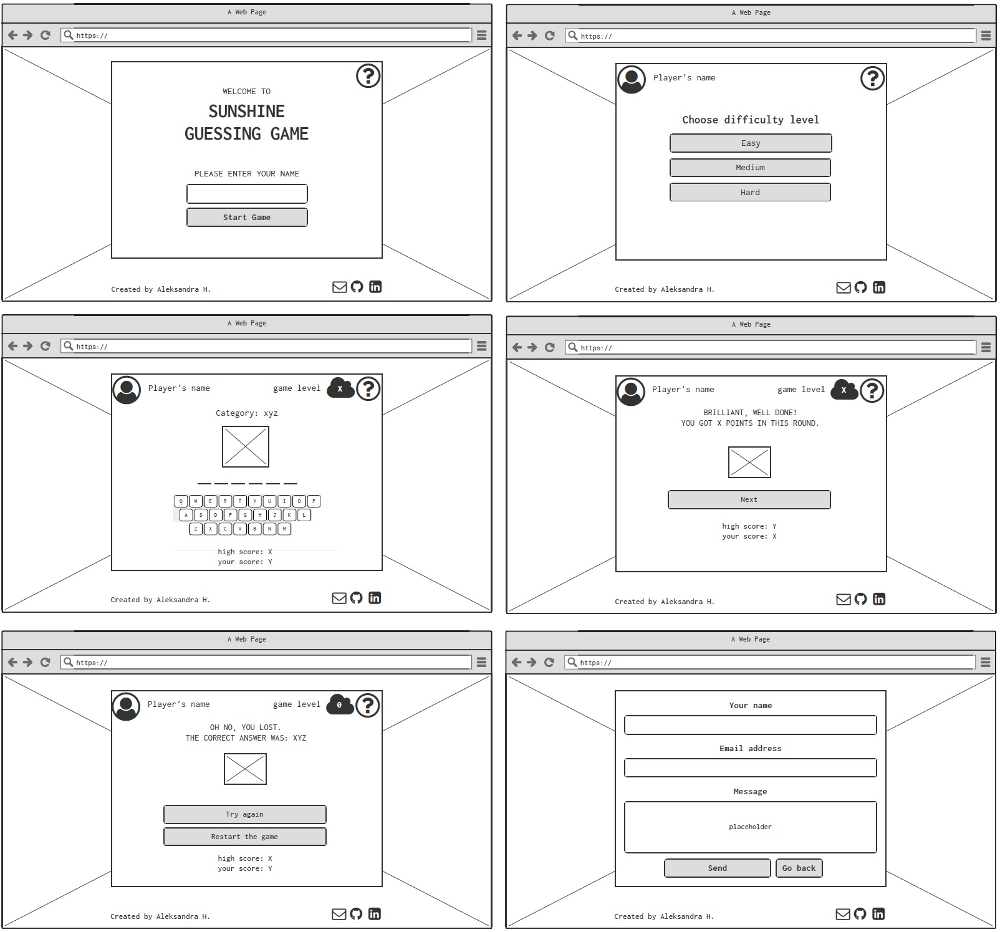

Medium screens - tablets

Small screens - mobile

## Technologies Used

### Languages

- HTML
- CSS
- JavaScript

### Frameworks, Libraries & Tools

- [Am I Responsive](http://ami.responsivedesign.is/) was used to create the multi-device mock-up you can see at the start of this README.md file.
- [Balsamiq](https://balsamiq.com/) to create the wireframes for the project
- [Bootstrap v5.1.3](https://getbootstrap.com/)
- [EmailJS](https://www.emailjs.com) used to send email from the contact form
- [Favicon.io](https://favicon.io) for making the site favicon
- [Font Awesome](https://fontawesome.com/) - Icons from Font Awesome were used throughout the site
- [Git](https://git-scm.com/) was used for version control within VSCode to push the code to GitHub
- [GitHub](https://github.com/) was used as a remote repository to store project code
- [Google Fonts](https://fonts.google.com/)
- [Pixabay.com](Pixabay.com) was used for pictures
- [Remove.bg](https://www.remove.bg/) was used to remove background on logos
- [Chrome dev tools](https://developers.google.com/web/tools/chrome-devtools) were used for debugging of the code and check site for responsiveness
- [WC3 Validator](https://validator.w3.org/), [Jigsaw W3 Validator](https://jigsaw.w3.org/css-validator/), [JShint](https://jshint.com/), [Wave Validator](https://wave.webaim.org/), [Lighthouse](https://developers.google.com/web/tools/lighthouse/) and [Am I Responsive](http://ami.responsivedesign.is/) were all used to validate the website

## Features

The website has 3 webpages consisting of 11 distinct features described below.

### Home screen

#### Title animation
- When the page is loaded the game title fades-in

See feature

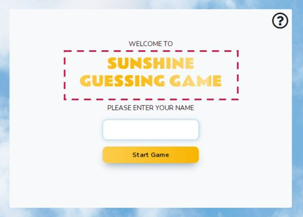

#### Username input
- User is asked to enter their name in the input field. The username needs to be between 1 and 12 characters long. The are no restrictions on characters type. However, if the input field is left blank, then a feedback message is displayed for user to try again. Once a valid username has been provided, the name is displayed next to the user icon on the next screen and user is able to select the difficulty level of the game.
- Username remains displayed on all game screens
- User stories covered: 2

See feature

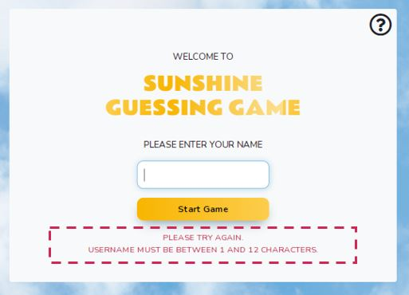

### Instructions Modal
- A modal with game instructions which pops up when the instructions icon is clicked
- Available on all game screens
- Background color is set slightly darker than on the game screen
- User stories covered: 1, 12

See feature

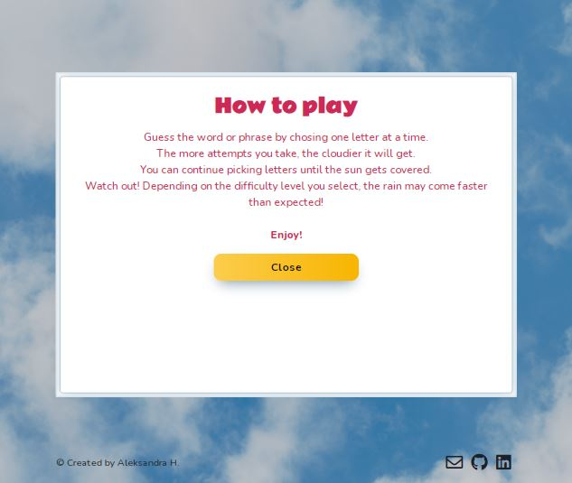

### Footer
- Featured on all pages
- Contains link to contact form (opening in the same window), github page and social media (opening in a separate window)
- User stories covered: 10

See feature

### Difficulty level screen
- User can choose difficulty level of the game they wish to play
- User stories covered: 3, 13

See feature

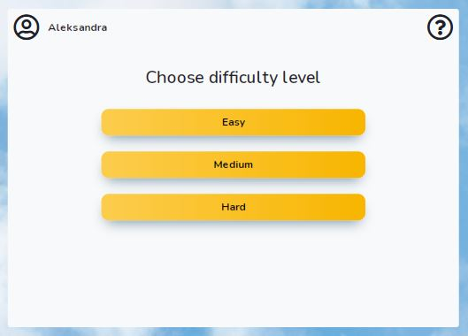

### Game screen
- The below elements are displayed on the screen:
  - Username
  - Selected difficulty level of the game
  - Number of guesses left in the round
  - Game instructions icon
  - Category of the phrase to be guessed
  - Image representing how many guesses were made
  - Underscores for each letter of the hidden phrase
  - Alphabet which work on mouse click or keyboard press
  - High score and current user score
- User stories covered: 4, 5, 6

See feature

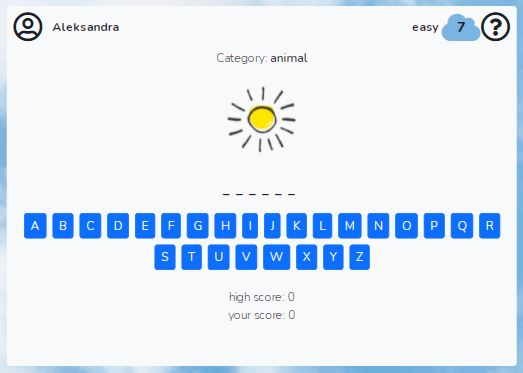

### Correct Guess Screen
- The below elements are displayed on the screen:
  - Username
  - Difficulty level of the game that is being played
  - Number of guesses that were left in the round - number of points scored
  - Complimentary message to the user
  - Number of points scored in the round
  - Picture of smiley sun
  - Button to start a new round
  - High score and current user score
- User stories covered: 7

See feature

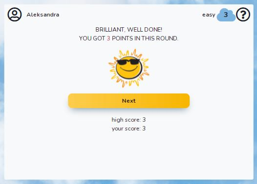

### Wrong Guess Screen
- The below elements are displayed on the screen:
  - Username
  - Difficulty level of the game that was played
  - Cloud icon with 0 guesses remaining
  - Phrase which has not been guessed
  - Picture of sad rainy cloud
  - Buttons to restart the game on same level or change the level
  - High score and current user score
- User stories covered: 8

See feature

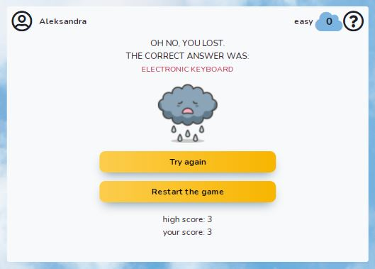

### Contact Form
- User is able to provide feedback about the game
- EmailJS has been used to send an email to developer with user's data and message
- User stories covered: 10

See feature

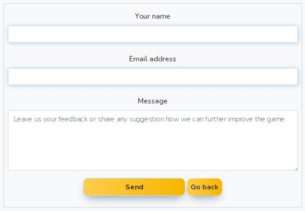

### Contact Form confirmation screen
- Thank you message is displayed
- Contains return to the main screen button
- User stories covered: 11

See feature

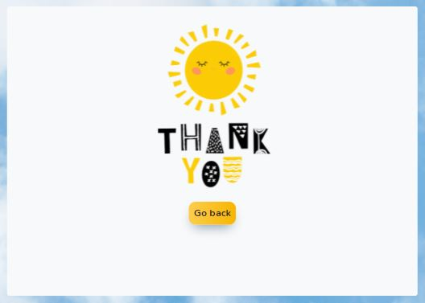

### 404 error page
- The site has been given a 404 error page which is displayed if the user enters a url that does not exist.
- Contains return to the main screen button
- User stories covered: 15

See feature

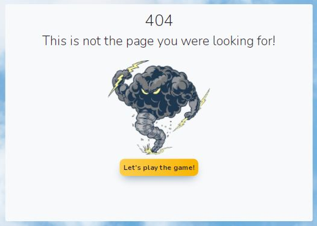

## Validation

### HTML Validation

The W3C Markup Validation Service was used to validate the HTML of the website. All pages pass with no errors.

Home

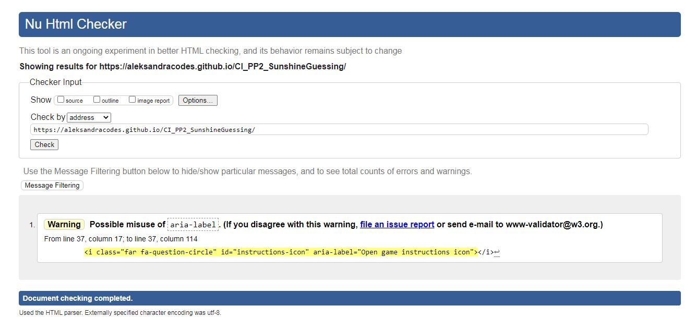

Contact form page

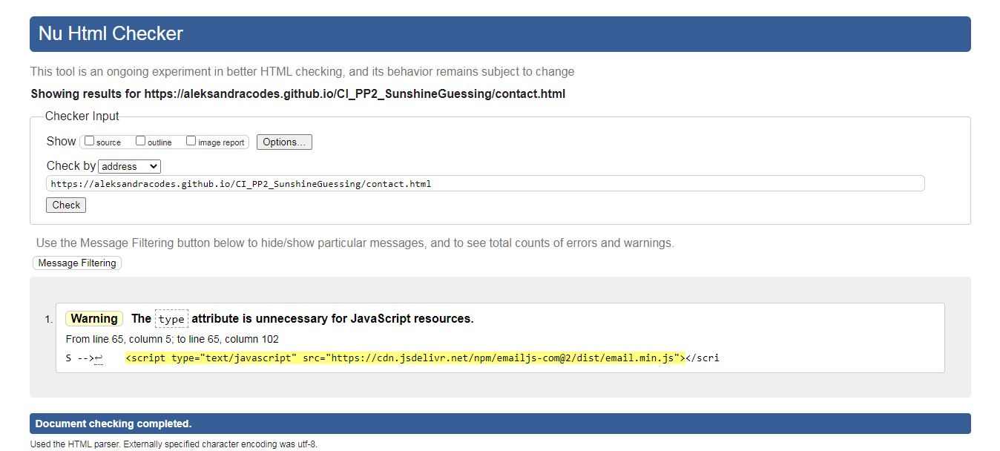

404 error page

### CSS Validation

The W3C Jigsaw CSS Validation Service was used to validate the CSS of the website.
When validating all website, it passes with no errors. However, some warning are identified linked to Bootstrap v5.1.3.
When validating my own internal CSS, the validator shows no errors and four warning associated with vendor extension (-webkit-appearance).

All site

Style.css

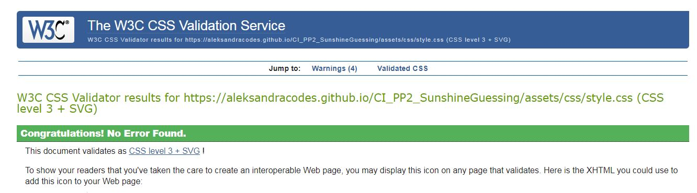
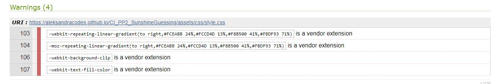

### JavaScript Validation

JSHint JS Validation Service was used to validate the Javascript files. No significant issues were found.

game.js

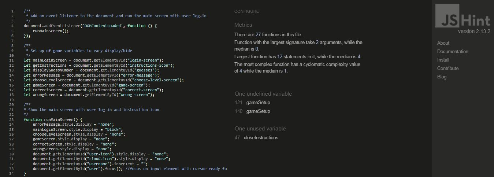

game-data.js

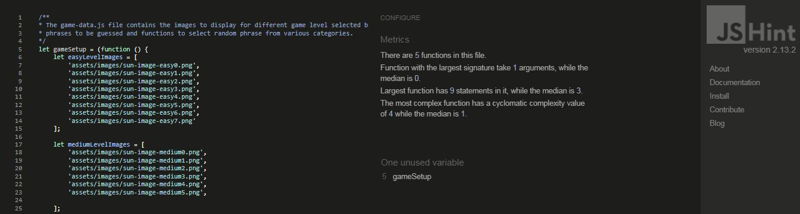

contact-form.js

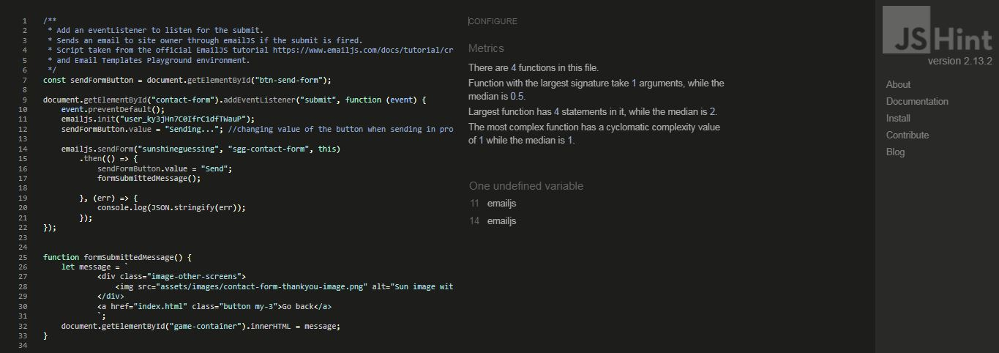

### Accessibility

The WAVE WebAIM web accessibility evaluation tool was used to ensure the website met high accessibility standards.
All site pass with 0 errors.

Home page
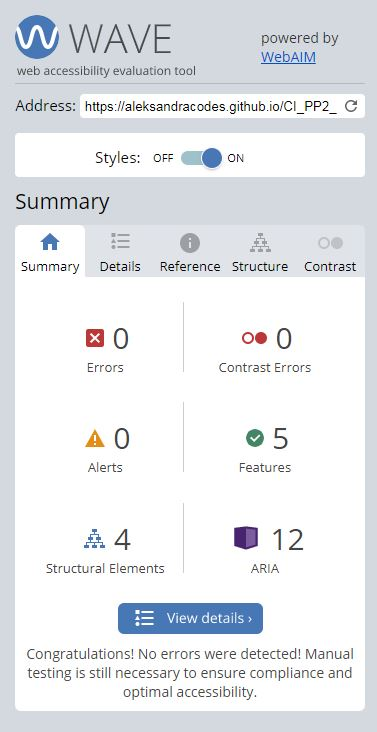

Contact form page
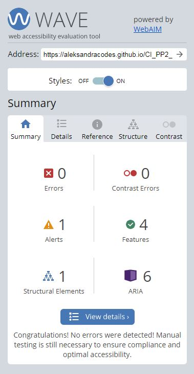

404 page
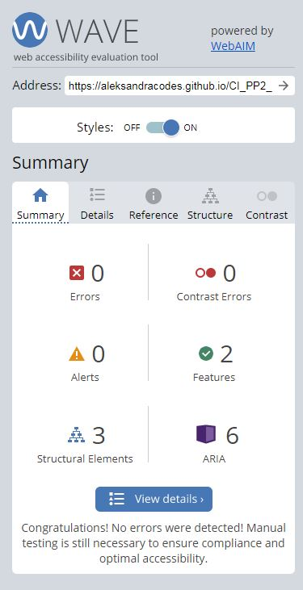

### Performance

Google Lighthouse in Google Chrome Developer Tools was used to test the performance of the website.

Home page
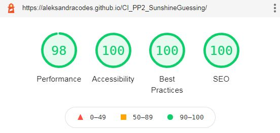

Contact form page
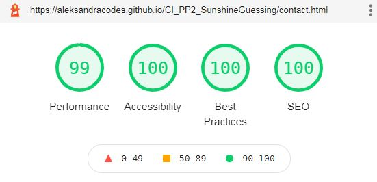

404 page

## Testing

### Performing tests on various devices

The website was tested using Google Chrome Developer Tools Toggle Device Toolbar to simulate viewports of different devices.

The website was tested on the following devices:
- Lenovo B590 (laptop screen size)
- Samsung Galaxy Tab A (tablet screen)
- Samsung S7 (mobile screen)
- Huawei P10 Lite (mobile screen)

### Browser compatibility

- Testing has been carried out on the following browsers:
  - Googe Chrome Version 96.0.4664.110 (Official Build) (64-bit)
  - Firefox Browser 95.0.2 (64-bit)

### Testing user stories

1. I want to easily understand the rules of the game

| **Feature**       | **Action**        | **Expected Result**                  | **Actual Result** |
| ----------------- | ----------------- | ------------------------------------ | ----------------- |
| Instructions Icon | Click on the icon | Modal with game instructions pops up | Works as expected |

Screenshot

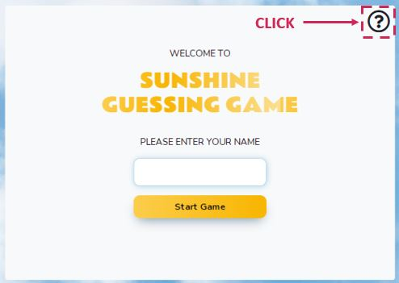

2. I want to enter my name and have it visible on screen while the game is played

| **Feature**    | **Action**                                                           | **Expected Result**                               | **Actual Result** |
| -------------- | -------------------------------------------------------------------- | ------------------------------------------------- | ----------------- |
| Username input | Type user name (1-12 characters) and click button or press Enter key | User log in and name displayed in top left corner | Works as expected |

Screenshot

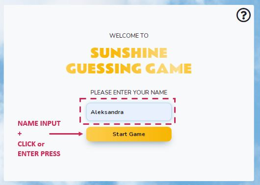
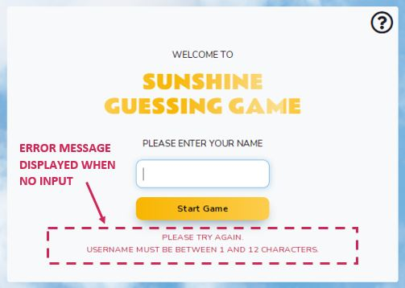
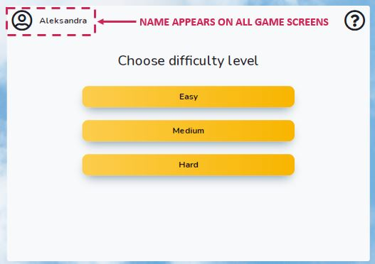

3. I want to be able to choose a difficulty level for the game

| **Feature**             | **Action**                                                             | **Expected Result**                                                                                                 | **Actual Result** |
| ----------------------- | ---------------------------------------------------------------------- | ------------------------------------------------------------------------------------------------------------------- | ----------------- |
| Difficulty level screen | Click one of the three buttons on the screen to play the relevant game | The game level screen loads of the chosen game. Game level and number of guesses are displayed on top right corner. | Works as expected |

Screenshot

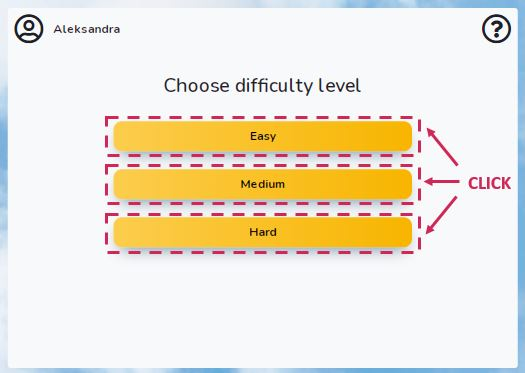
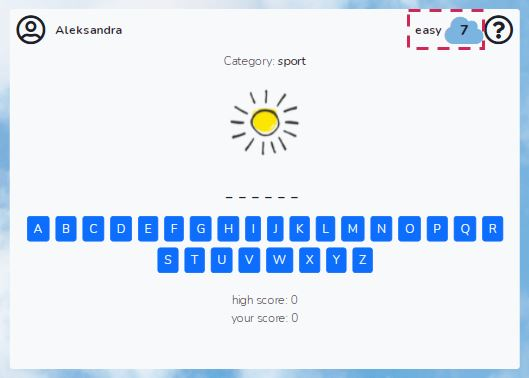
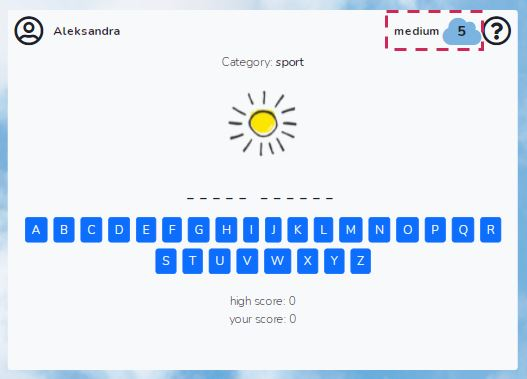
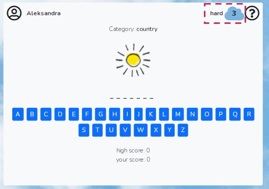

4. I want to have different categories of phrases to guess from

| **Feature**                           | **Action**                               | **Expected Result**                                                       | **Actual Result** |
| ------------------------------------- | ---------------------------------------- | ------------------------------------------------------------------------- | ----------------- |
| Difficulty level screen & Game screen | Select the level of desired game to play | The phrase category is displayed on the game screen above the sun picture | Works as expected |

Screenshot

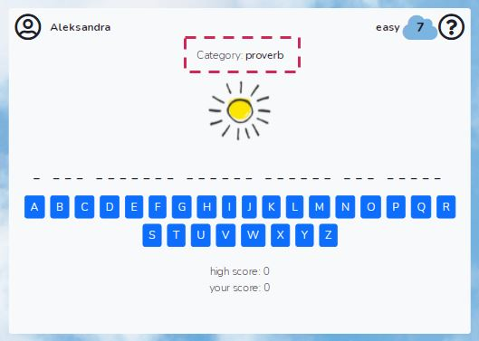
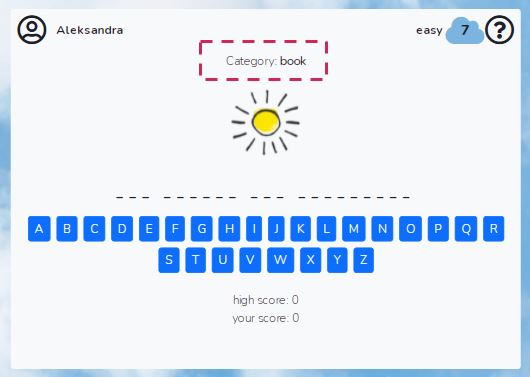

5. I want to be able to play the game both by clicking the mouse and by using the keyboard

| **Feature** | **Action**                                                               | **Expected Result**                                                                        | **Actual Result** |
| ----------- | ------------------------------------------------------------------------ | ------------------------------------------------------------------------------------------ | ----------------- |
| Game screen | Click on the displayed alphabet buttons or press the key on the keyboard | The letter which have already been clicked/pressed changes color and cannot be used again. | Works as expected |

Screenshot

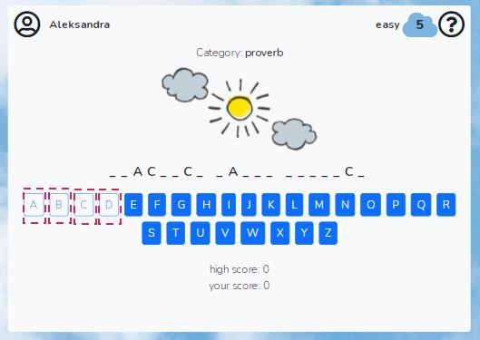

6. I want to be able to see which letters I have already guessed and the number of guesses I have left in the round

| **Feature** | **Action**                                                               | **Expected Result**                                                                                              | **Actual Result** |
| ----------- | ------------------------------------------------------------------------ | ---------------------------------------------------------------------------------------------------------------- | ----------------- |
| Game screen | Click on the displayed alphabet buttons or press the key on the keyboard | Used letters change color and cannot be used again. Number of remaining guesses is displayed in top right corner | Works as expected |

Screenshot

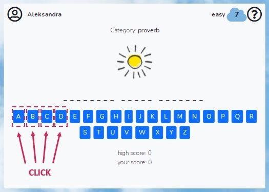
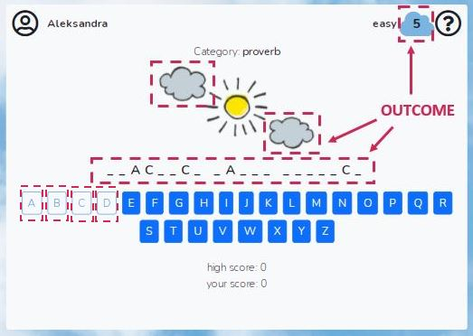

7. I want to see my result after I guessed the phrase

| **Feature**          | **Action**                                                                            | **Expected Result**                                             | **Actual Result** |
| -------------------- | ------------------------------------------------------------------------------------- | --------------------------------------------------------------- | ----------------- |
| Correct Guess Screen | Guess the hidden phrase within specific number of guesses for the game level selected | The message and number of points scored in the round displayed. | Works as expected |

Screenshot

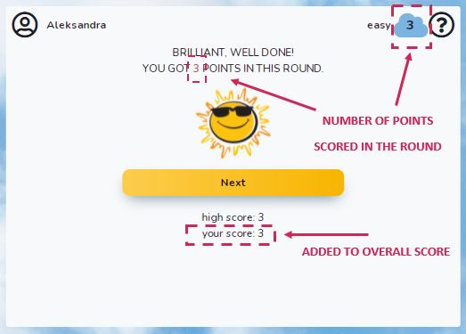

8. I want to see the phrase I didn’t manage to guess

| **Feature**        | **Action**                                              | **Expected Result**             | **Actual Result** |
| ------------------ | ------------------------------------------------------- | ------------------------------- | ----------------- |
| Wrong Guess Screen | All guesses were used and the hidden phrase not guessed | The correct phrase is displayed | Works as expected |

Screenshot

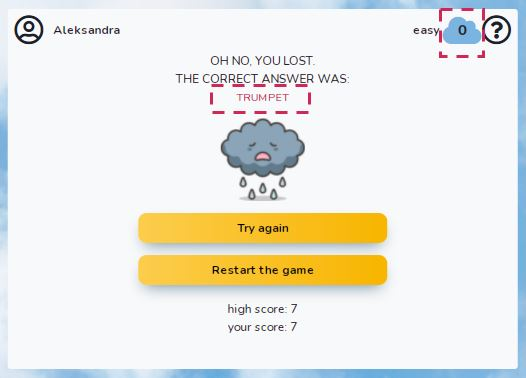

9. I want to be able to play the game on desktop, tablet and mobile devices

| **Feature**                                   | **Action**                | **Expected Result**                      | **Actual Result** |
| --------------------------------------------- | ------------------------- | ---------------------------------------- | ----------------- |
| Every page has been designed to be responsive | Change device screen size | The site works on different screen sizes | Works as expected |

Screenshot

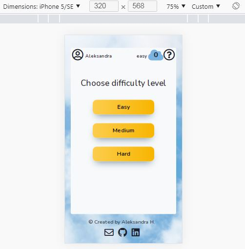

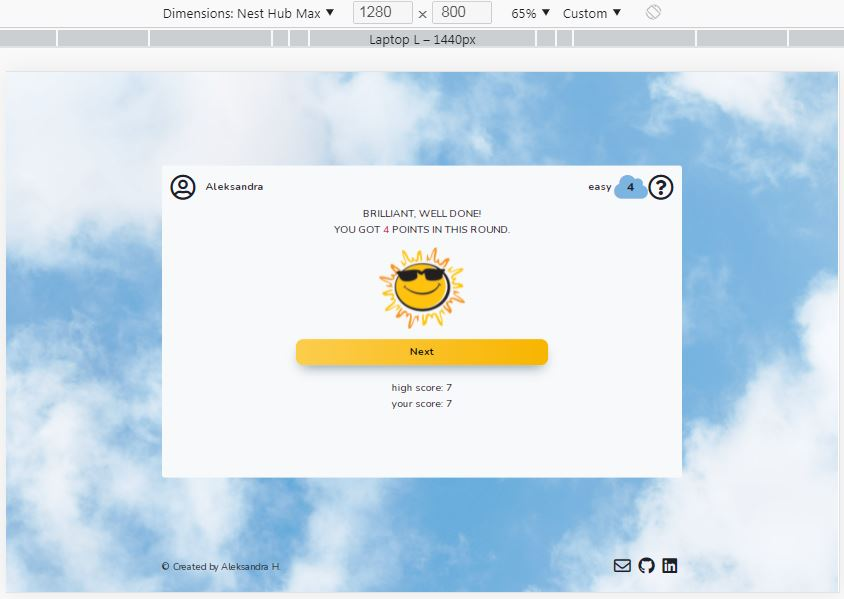

10. I want to be able to get in touch with the developer

| **Feature**  | **Action**                               | **Expected Result**       | **Actual Result** |
| ------------ | ---------------------------------------- | ------------------------- | ----------------- |
| Contact Form | Click on the envelope icon in the footer | Displays the contact form | Works as expected |

Screenshot

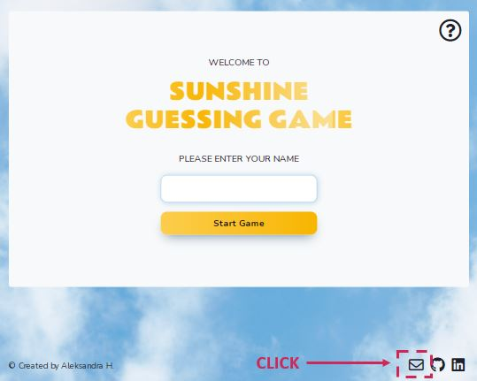
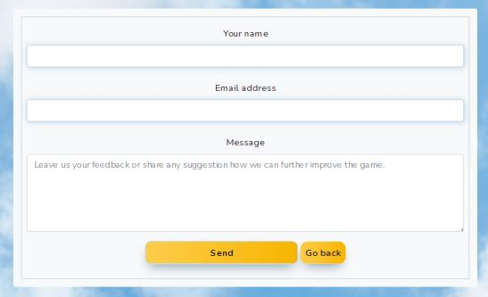

11. I want to be sure that my message has been sent

| **Feature**                      | **Action**                                           | **Expected Result**                        | **Actual Result** |
| -------------------------------- | ---------------------------------------------------- | ------------------------------------------ | ----------------- |
| Contact Form confirmation screen | Fill in the contact form and click the submit button | The contact form confirmation is displayed | Works as expected |

Screenshot

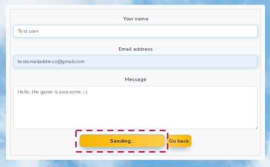

12. I want user to easily understand the game

| **Feature**       | **Action**                      | **Expected Result**                  | **Actual Result** |
| ----------------- | ------------------------------- | ------------------------------------ | ----------------- |
| Instructions Icon | Click on the icon on any screen | Modal with game instructions pops up | Works as expected |

Screenshot

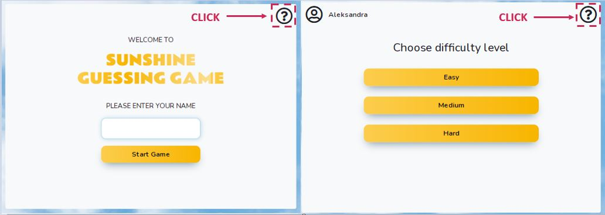
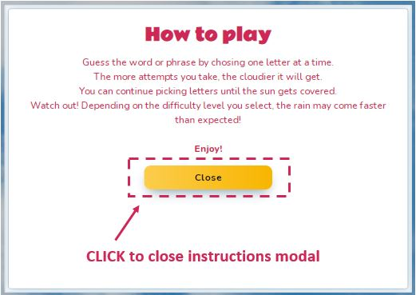

13.  I want the user to be able to challenge themselves

| **Feature**             | **Action**                                                                                                                  | **Expected Result**                             | **Actual Result** |
| ----------------------- | --------------------------------------------------------------------------------------------------------------------------- | ----------------------------------------------- | ----------------- |
| Difficulty level screen | User selects on of the three available levels of the game which includes the hard version with only a few available guesses | The game level screen loads of the chosen game. | Works as expected |

Screenshot

14. I want my game to be fully responsive

| **Feature**                                   | **Action**                | **Expected Result**                      | **Actual Result** |
| --------------------------------------------- | ------------------------- | ---------------------------------------- | ----------------- |
| Every page has been designed to be responsive | Change device screen size | The site works on different screen sizes | Works as expected |

Screenshot

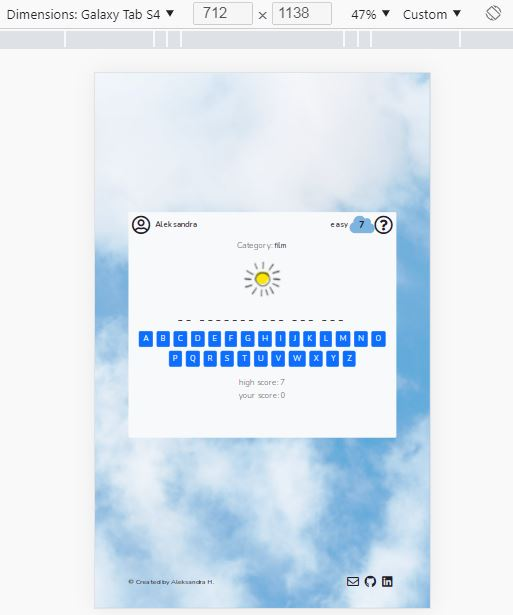
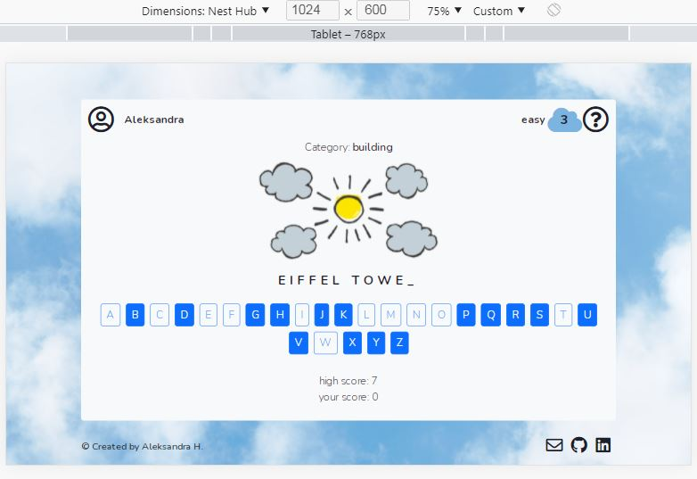

15.  I want the user to come to a 404 error page instead of having to use the browser back button if they enter a url that does not exist

| **Feature**    | **Action**           | **Expected Result**                                                                       | **Actual Result** |
| -------------- | -------------------- | ----------------------------------------------------------------------------------------- | ----------------- |
| 404 error page | Page cannot be found | When a user types the wrong address or cannot find a page they are rerouted to a 404 page | Works as expected |

Screenshot

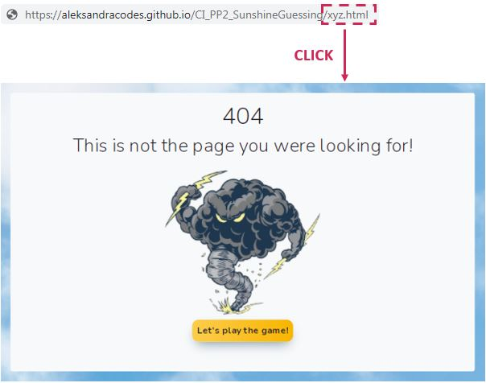

16. I want user to be able to contact me and provide their feedback

| **Feature**  | **Action**                                                  | **Expected Result**                                              | **Actual Result** |
| ------------ | ----------------------------------------------------------- | ---------------------------------------------------------------- | ----------------- |
| Contact Form | User fills in the contact form and clicks the submit button | Developer receives email with user's contact details and message | Works as expected |

Screenshot

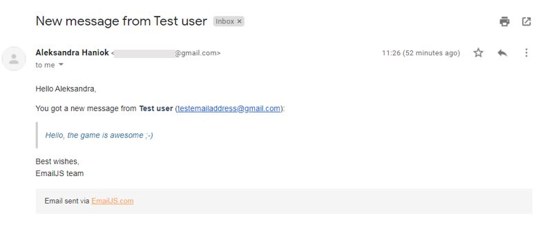

## Bugs

## Deployment

### GitHub Pages
The website was deployed using GitHub Pages by following these steps:
1. In the GitHub repository navigate to the Settings tab
2. On the left hand menu select Pages
3. For the source select Branch: main
4. Once saved, GitHub will refresh and your website will be publishd from GitHub repository
5. The link to your published website will appear: "Your site is published at https://aleksandracodes.github.io/CI_PP2_SunshineGuessing/"

### Forking the GitHub Repository
1. Go to the GitHub repository
2. Click on Fork button in top right corner

### Making a Local Clone
1. Go to the GitHub repository 
2. Locate the Code button above the list of files and click it
3. Highlight the "HTTPS" button to clone with HTTPS and copy the link
4. Open Git Bash
5. Change the current working directory to the one where you want the cloned directory
6. Type git clone and paste the URL from the clipboard ($ git clone https://github.com/YOUR-USERNAME/YOUR-REPOSITORY)
7. Press Enter to create your local clone

## Credits

### Images

### Code

## Acknowledgements