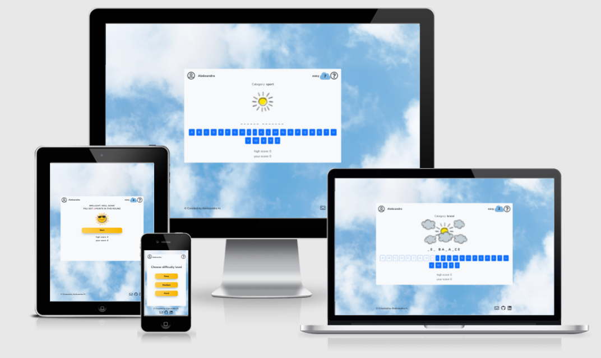

# Sunshine Guessing Game 

**Developer: Aleksandra Haniok**

[Visit live website](https://aleksandracodes.github.io/CI_PP2_SunshineGuessing/)

## Project Goals

The goal of this project was to create an interactive and user-friendly version of the well-known Hangman game.

### User Goals

- Play a game with simple rules that is fun and engaging
- Challenge themselves on different word and phrases

### Site Owner Goals

- Create a game which is entertaining and engaging
- Create visually appealing design
- Create a simple navigation around website
- Provide fully responsive and accessible website

## User Experience

### Target Audience

### User Requirements and Expectations

## User Stories

### Site User

### Site Owner

## Design

### Colour

### Fonts

### Structure

### Wireframes

## Technologies Used

### Languages

### Frameworks, Libraries & Tools

## Features

## Validation

### HTML Validation

### CSS Validation

### JavaScript Validation

### Accessibility

### Performance

## Testing

### Performing tests on various devices

### Browser compatibility

### Testing user stories

## Bugs

## Deployment

### GitHub Pages

### Forking the GitHub Repository

### Making a Local Clone

## Credits

### Images

### Code

## Acknowledgements